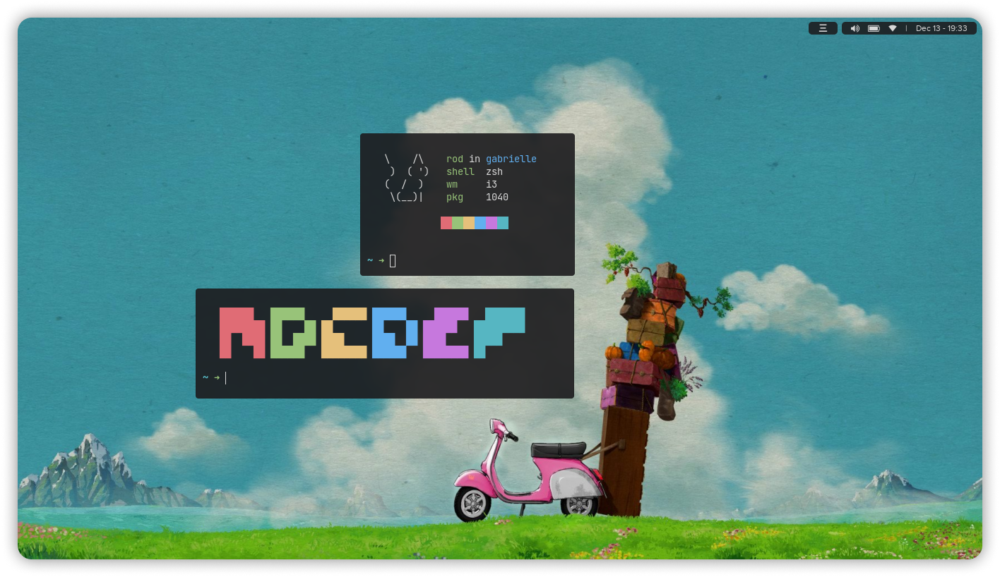
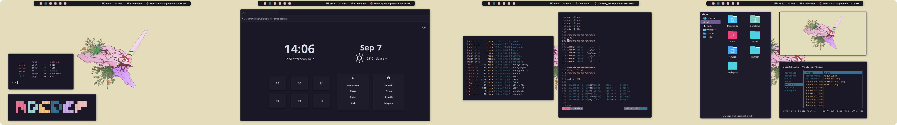

 

  

 

## 👇 Index
- [👇 Index](#-index)
- [🎨 Config files:](#-config-files)
- [🚀 Projects used:](#-projects-used)
- [🖼️ Wallpapers:](#️-wallpapers)
- [🎉 Gallery](#-gallery)

## 🎨 Config files:

| Program                        | Name                                                                                                                         |
| ------------------------------ | ---------------------------------------------------------------------------------------------------------------------------- |
| 🎨 Color Scheme (And GTK theme) | [Rosé Pine](https://github.com/rose-pine)                                                                                    |
| 📁 Icon theme                   | [Luv Icons](https://github.com/Nitrux/luv-icon-theme)                                                                        |
| 🚀 Window Manager               | [Bspwm](https://github.com/baskerville/bspwm)                                                                                |
| 🚧 Bar                          | [Polybar](https://github.com/polybar/polybar)                                                                                |
| 💾 Launcher                     | [Rofi](https://github.com/davatorium/rofi)                                                                                   |
| 🌍 Web Browser                  | [Firefox](https://www.mozilla.org/en-US/firefox/new/?redirect_source=firefox-com)                                            |
| 🖊️ Text Editor                  | [VSCode](https://aur.archlinux.org/packages/visual-studio-code-bin/?O=10&PP=10) & [Neovim](https://github.com/neovim/neovim) |
| 🐚 Shell                        | [Fish](https://github.com/fish-shell/fish-shell)                                                                             |
| ⌨️ Terminal                     | [Alacritty](https://github.com/alacritty/alacritty)                                                                          |
| 📄 Document Viewer              | [Zathura](https://github.com/alacritty/alacritty)                                                                            |
| 👔 GTK                          | [Rosé Pine](https://github.com/rose-pine/gtk)                                                                                |
| 🎵 Music Player                 | [Ncmpcpp](https://github.com/ncmpcpp/ncmpcpp)                                                                                |

## 🚀 Projects used:

- The **Firefox** custom userstyle: [🦊 SimpleFox](https://github.com/migueravila/SimpleFox)
- The **Startpage**: [🍱 Bento](https://github.com/migueravila/Bento)
- The terminal **ST**: [⌨️ SimplierTerminal](https://github.com/migueravila/SimplierTerminal)

## 🖼️ Wallpapers:

 

 

## 🎉 Gallery

 

