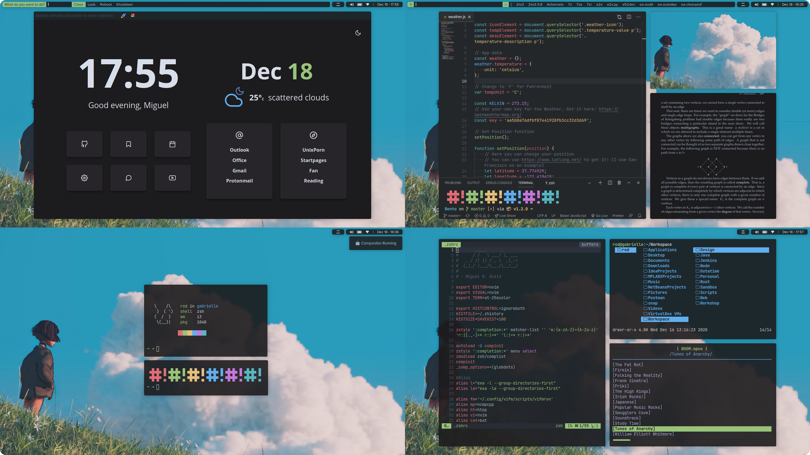

<h1>Dotfiles</h1>
<b>🌱 Personal Dotfiles Repo</b>

### In this repo you can find:

- Config files for **i3** and **i3blocks**
- Zathura, ncmpcpp and Lf config files
- **Polybar** config file
- **Neovim** configuration files
- The config files for the **Alacritty** Terminal

### Other projects I use with my dotfiles:

- The build of **Dmenu**: [⚡ CleanDmenu](https://github.com/MiguelRAvila/CleanDmenu)
- VSCode theme: [🌻 Minone](https://github.com/MiguelRAvila/Minone)
- The **Firefox** custom userstyle: [🦊 SimplerentFox](https://github.com/MiguelRAvila/SimplerentFox)
- The **Startpage**: [🍱 Bento](https://github.com/MiguelRAvila/Bento)
- The build the st terminal **ST**: [⌨️ SimplierTerminal](https://github.com/MiguelRAvila/SimplierTerminal)
- All my dmenu **scripts** [DmenuScripts](https://github.com/MiguelRAvila/DmenuScripts)

